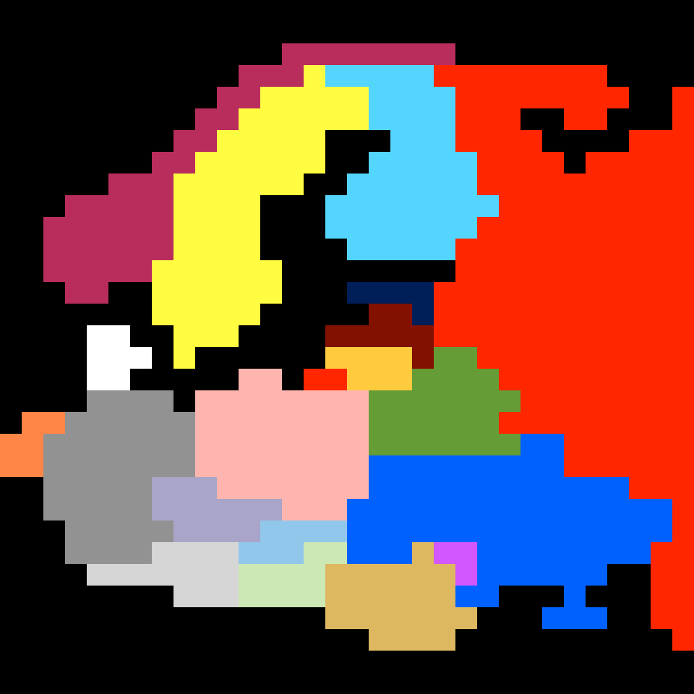

# Political Map

```
................................
................................
.............WWWWWWWW...........
...........WWWSFFFFFZZZZZZZZ....
..........WWSSSSSFFFFZZZZZZZZ..Z
.........WWSSSSSSFFFFZZZ..ZZ...Z
........WWSSSSS...FFFZZZZ....ZZZ
.......WWSSSSSS..FFFFFZZZZ.ZZZZZ
.....WWWSSSSSS..FFFFFFZZZZZZZZZZ
...WWWWWSSSS...FFFFFFFFZZZZZZZZZ
..WWWWWWSSSS...FFFFFFFZZZZZZZZZZ
..WWWWWWSSSS....FFFFFZZZZZZZZZZZ
..WWWWWSSSSSS........ZZZZZZZZZZZ
...WW..SSSSSS...EEEEZZZZZZZZZZZZ
.......SSSSS.....VVEZZZZZZZZZZZZ
....DD..SSS....VVVVVZZZZZZZZZZZZ
....DDD.S......LLLLVBBZZZZZZZZZZ
....DD.....PP.ZZLLLBBBBZZZZZZZZZ
....GGGG.PPPPPPPPBBBBBBBZZZZZZZZ
.NNGGGGGGPPPPPPPPBBBBBBZZZZZZZZZ
NNGGGGGGGPPPPPPPPBBBBBBBUUZZZZZZ
NNGGGGGGGPPPPPPPPUUUUUUUUUZZZZZZ
..GGGGGCCCPPPPPPPUUUUUUUUUUUUZZZ
..GGGGGCCCCCCPPPUUUUUUUUUUUUUUUZ
...GGGGGCCCCKKKKUUUUUUUUUUUUUUUZ
...GGGGOOOOKKKHHUUURMMUUUUUUUUZZ
....OOOOOOOHHHHRRRRRRMUUUUUU..ZZ
........OOOHHHHRRRRRRUU...U...ZZ
...............RRRRRRR...UUU..ZZ
.................RRRR..........Z
................................
................................
```

#### Legend:
- S = Sweden
- D = Denmark
- W = Norway
- F = Finland
- G = Germany
- N = Netherlands
- E = Estonia
- V = Latvia
- L = Lithuania
- P = Poland
- B = Belarus
- C = Czechia
- K = Slovakia
- O = Austria
- R = Romania
- H = Hungary
- U = Ukraine
- M = Moldova
- Z = Russia


